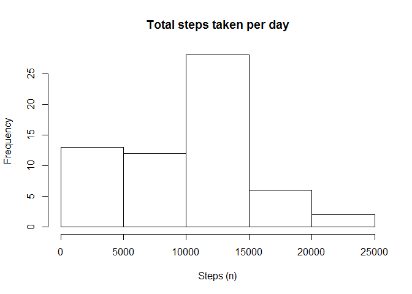

# Reproducible Research: Peer Assessment 1


## Loading and preprocessing the data


```r
library(ggplot2)
setwd("C://MY_DOCS/CSC/RWorkingDir/ReproducibleResearchCourse/RepData_PeerAssessment1/")
if(!file.exists("activity.csv")) {
  unzip("activity.zip")
}

mydat <- read.csv("activity.csv")
```

## What is mean total number of steps taken per day?


```r
# current date that we add up the total number of steps for
curDate <- mydat[1, "date"]
# sum of the steps for the current date
dayStepsSum <- 0
# what day we are on
day <- 1
# vector of steps per each day
stepsByDay <- numeric(length = length(unique(mydat[,"date"])))
# for loop counts the steps for each day and puts the sum in the 'stepsByDay'
# vector
for (i in 1:nrow(mydat)) {
  if (mydat[i, "date"] == curDate) {
    if (!is.na(mydat[i, "steps"])) {
      dayStepsSum <- sum(dayStepsSum, as.numeric(mydat[i, "steps"]))
    }
  }
  else {
    stepsByDay[day] <- dayStepsSum
    day <- day + 1
    curDate <- mydat[i, "date"]
    dayStepsSum <- 0
    if (!is.na(mydat[i, "steps"])) {
      dayStepsSum <- as.numeric(mydat[i, "steps"])
    }
  }
}
# histogram of the number of steps taken each day
hist(stepsByDay, xlab = "Steps (n)"
     , main = "Total steps taken per day (NA's replaced)")
```

 

```r
# take the mean
meanStepsPerDay <- mean(stepsByDay)
# take the median
medianStepsPerDay <- median(stepsByDay)
```
Mean number of steps per day:

```
## [1] 9354.23
```
Median number of steps per day:

```
## [1] 10395
```

## What is the average daily activity pattern?


```r
# days is the unique values that the date column of the data frame take on
days <- unique(mydat[, "date"])

# intervals are the unique values that the interval column of the data frame
# take on
intervals <- unique(mydat[, "interval"])

# avg number of steps factored by interval
avgStepsByInterval <- numeric(length = length(intervals))

# number of different values interval column of data frame can take on
numIntervals <- length(intervals)

totalSteps <- 0 # total steps for that interval accross all days
for (i in 1:numIntervals) {
  for (j in 1:length(days)) {
    # total the steps for this interval
    todaysStepsThisInterval <- mydat[i + numIntervals*(j - 1), "steps"]
    if (!is.na(todaysStepsThisInterval)) {
     totalSteps <- totalSteps + todaysStepsThisInterval
    }
    else {
      # do nothing because there was an NA value
    }
  }
  # set the avg to the total and wait to average them
  avgStepsByInterval[i] <- totalSteps
  
  # new day so we reset the total steps for that day variable
  totalSteps <- 0
}

# now we avg them as a vectorized operation
avgStepsByInterval <- avgStepsByInterval / length(days)

plot(intervals, avgStepsByInterval, type = "l", xlab = "Interval"
     , ylab = "Average number of steps (n)"
     , main = "Average number of steps by interval")
```

 

The interval with the highest average steps per that interval averaged accross all days:

```
## [1] 835
```

## Inputting missing values


```r
na    <- !complete.cases(mydat[, "steps"])
```
Number of rows with NA entries:

```
## [1] 2304
```
We will fill in the missing values (NA's) in the "steps" column of the data frame with the mean number of steps for that interval accross all days.

```r
# Fill in the missing Values
for (i in 1:numIntervals) {
  for (j in 1:length(days)) {
    # get the number of steps this day this interval
    todaysStepsThisInterval <- mydat[i + numIntervals*(j - 1), "steps"]
    
    # if the number is na, fill it with the average number of steps for this
    # interval averaged across all days
    if (is.na(todaysStepsThisInterval)) {
      mydat[i + numIntervals*(j - 1), "steps"] <- avgStepsByInterval[i]
    }
  }
}
# total steps by day for histogram

# current date that we add up the total number of steps for
curDate <- mydat[1, "date"]

# sum of the steps for the current date
dayStepsSum <- 0

# what day we are on
day <- 1

# vector of steps per each day
stepsByDay <- numeric(length = length(unique(mydat[,"date"])))
for (i in 1:nrow(mydat)) {
  if (mydat[i, "date"] == curDate) {
    dayStepsSum <- sum(dayStepsSum, as.numeric(mydat[i, "steps"]))
  }
  else {
    stepsByDay[day] <- dayStepsSum
    day <- day + 1
    curDate <- mydat[i, "date"]
    dayStepsSum <- 0
    dayStepsSum <- as.numeric(mydat[i, "steps"])
  }
}

# histogram of the total number of steps per day with the replaced values
hist(stepsByDay, xlab = "Steps (n)"
     , main = "Total steps taken per day (NA's replaced)")
```

 

The newly calculated mean with the missing values replaced:

```
## [1] 10427.67
```

The newly calculated median with the missing values replaced:

```
## [1] 10395
```


## Are there differences in activity patterns between weekdays and weekends?


```r
# a vector with the day of the week each row of the dataframe corresponds to
weekdays <- weekdays(as.Date(mydat$date))

# make a new factor in the dataframe that takes on the value "weekday" if that
# row is a weekday and "weekend" if that row is a weekend day
mydat$daytype <- ifelse(weekdays %in% c("Saturday", "Sunday"), "weekend", "weekday")


# Make two datasets that are seperated by daytype factor
weekdayData <- mydat[mydat$daytype == "weekday",]
weekendData <- mydat[mydat$daytype == "weekend",]

# the average number of steps factored by interval for weekdays, made into a
# dataframe that has everything we need to compare the average steps per
# interval for weekdays and weekend days
avgStepsByIntervalWeekday <- data.frame(aggregate(steps ~ interval, data = weekdayData, mean), daytype = rep("weekday", length(intervals)))

# the average number of steps factored by interval for weekend days, made into
# a dataframe that has everything we need to compare the average steps per
# interval for weekdays and weekend days
avgStepsByIntervalWeekend <- data.frame(aggregate(steps ~ interval, data = weekendData, mean), daytype = rep("weekend", length(intervals)))

# combine the dataframes
mydat <- rbind(avgStepsByIntervalWeekend, avgStepsByIntervalWeekday)

# plot the average number of steps by interval factored by weekday vs weekend
# day
```

Now to plot the average number of steps taken factored by weekday/weekend day and by interval
 
